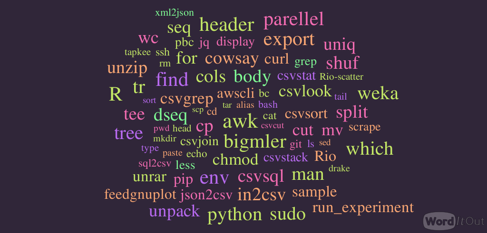
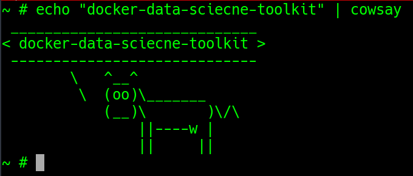

# Docker Container for Data Science Toolkit (DST)



This docker container is to make all data science tools available in a container to start your data science work in seconds.

More details about the project

- [Data Science at the Command Line](http://datascienceatthecommandline.com)
- [Data Science Toolbox](http://datasciencetoolbox.org)

Before moving to know about What, Why and How to use DST. I wanted to acknowledge [Jeroen Janssens](http://jeroenjanssens.com) for such a wonderful tool kit for data science.

Here is the blog post to know more about this [docker-data-science-toolkit]()

### How to use docker container

The simple and quick way to use this `data-science-toolkit` is as follows.

**Softwares required to use docker container**

- Docker (Tested version 1.12.1)

#### Steps to use container

- Pull the `data-science-toolkit` image from the [docker hub](https://hub.docker.com/r/appsecco/data-science-toolkit)

```
docker pull appsecco/data-science-toolkit
```

- Use the docker container with interactive shell and persistent storage from host system

```
docker run -v `pwd`:/data -it appsecco/data-science-toolkit sh
```

- Then start working with your data science operations


### Buiding docker image

- Clone the git repository 

```
git clone https://github.com/appsecco/docker-data-science-toolkit.git
```

- Start the build by running below command


```
cd docker-data-science-toolkit
docker build -t data-science-toolkit .
```

- Then start the container by running

```
docker run -v `pwd`:/data -it data-science-toolkit sh
```

- Then start working with your data science operations


### Docker-Data-Science-Toolkit in Action




### To-Do list

Please have a look at [to-do list](tool-list.md)

Please feel free to make a pull request or tweet to me [@madhuakula](https://twitter.com/madhuakula) for improvements and suggestions

